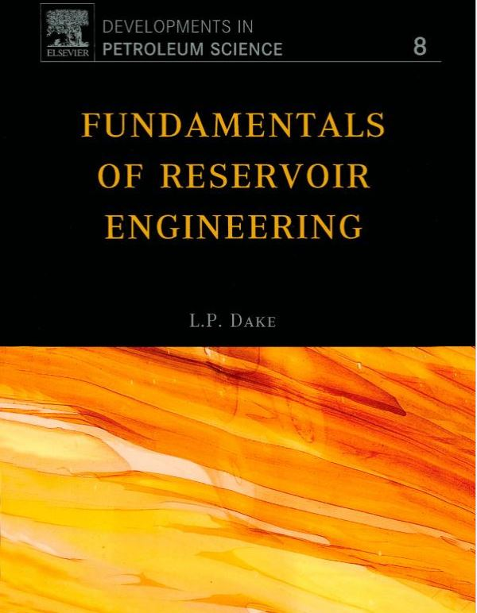

# Python-for-reservoir-engineering

Python Jupyter notebooks. 

Programmable Reservoir Engineering using the book "Fundamentals of reservoir engineering" by author L. P.  Dake. 

This project is in progress.

